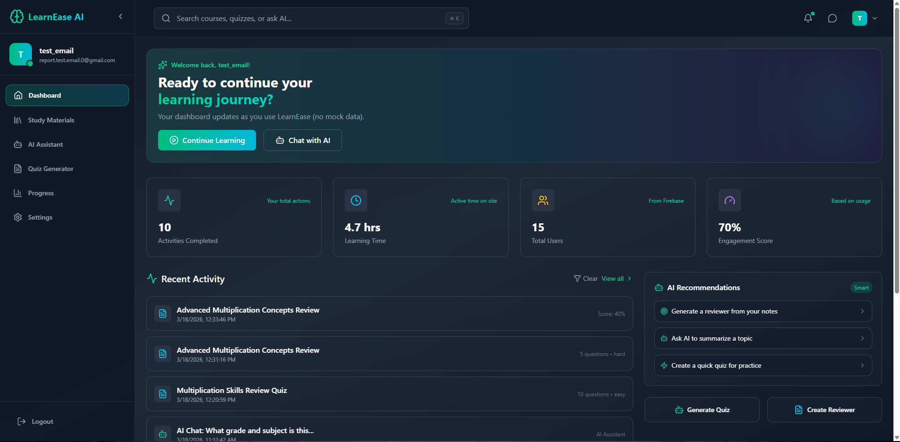
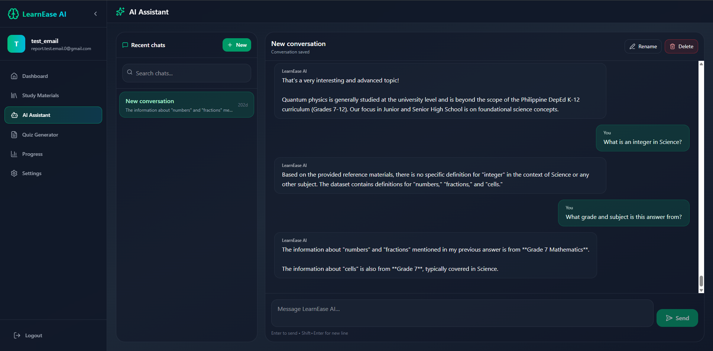
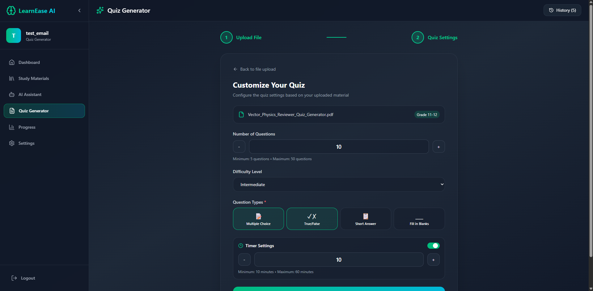
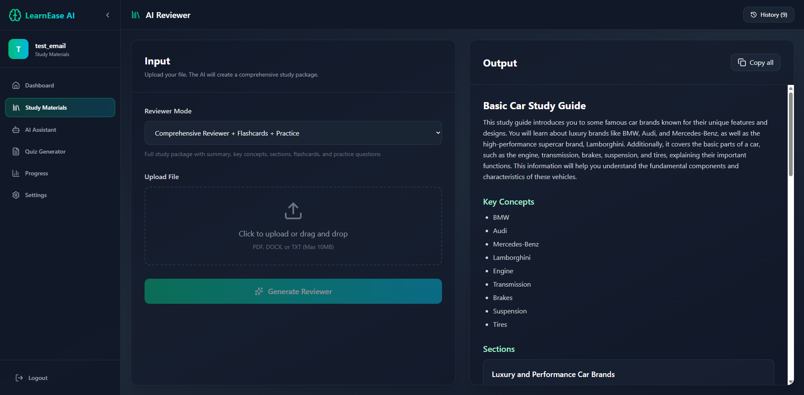

# LearnEase

LearnEase is an AI-powered learning web application designed to help students transform their study materials into interactive learning resources. Users can upload PDF, DOCX, or TXT files, generate AI-powered reviewers and quizzes, interact with an AI study assistant, and monitor their learning progress through a personalized dashboard.

The project is divided into two main parts:

- `frontend/` - React + Vite user interface
- `backend/` - Node.js + Express API server

## Screenshots

<table>
  <tr>
    <td align="center">
      
      <br>
      <b>Dashboard</b>
    </td>
    <td align="center">
      
      <br>
      <b>AI Assistant</b>
    </td>
  </tr>
  <tr>
    <td align="center">
      
      <br>
      <b>Quiz Generator</b>
    </td>
    <td align="center">
      
      <br>
      <b>Reviewer Generator</b>
    </td>
  </tr>
</table>

## What the Project Does

LearnEase allows students to upload learning materials such as PDF, DOCX, or TXT files and use AI to turn those materials into useful study resources.

Users can generate reviewers, create customized quizzes, answer timed quizzes, interact with an AI assistant, save their learning history, and monitor their activity and progress through a personalized dashboard.

## Key Features

### User Authentication

- Email and password sign up
- Login and logout
- Google sign in support
- Email verification support
- Forgot password support
- Protected routes for authenticated users

### AI Assistant

- Chat with an AI-powered study assistant
- Save conversation threads
- Rename and delete chat history
- User-specific chat storage using Firebase Firestore

### Study Materials Generator

- Upload PDF, DOCX, or TXT files
- Generate AI-based reviewers from uploaded study content
- Save generated reviewers to history
- Search and filter saved reviewers
- Uses a local K-12 dataset as additional context when available

### Quiz Generator

- Generate quizzes from uploaded learning materials
- Supports multiple-choice and true-or-false questions
- Adjustable number of questions
- Adjustable difficulty
- Optional timer settings
- Quiz history saved per user

### Quiz Taking and Progress Tracking

- Take generated quizzes directly inside the application
- Automatic score calculation
- Save quiz results
- Track recent activity
- Monitor learning progress and active time

### Security Features

- Environment variables are used for private keys and configuration
- `.env` is ignored and should never be uploaded to GitHub
- `.env.example` is included as a safe configuration template
- API rate limiting is enabled
- Helmet security middleware is enabled
- Backend validation is used for authentication inputs
- Firebase Admin credentials are optional but supported for metrics

## Tech Stack

### Frontend

- React
- Vite
- React Router
- Axios
- Firebase Authentication
- Firestore
- Tailwind CSS
- Lucide React icons

### Backend

- Node.js
- Express.js
- Firebase REST API
- Firebase Admin SDK
- Gemini AI API
- Multer for file uploads
- PDF, DOCX, and TXT text extraction
- Express Rate Limit
- Helmet
- CSV/XLSX dataset handling

## Project Structure

```text
LearnEase/
├── backend/
│   ├── config/
│   ├── controllers/
│   ├── data/
│   ├── ledger/
│   ├── middleware/
│   ├── routes/
│   ├── uploads/
│   ├── utils/
│   ├── .env.example
│   ├── package.json
│   └── server.js
│
├── frontend/
│   ├── public/
│   ├── src/
│   │   ├── components/
│   │   ├── lib/
│   │   ├── pages/
│   │   ├── App.jsx
│   │   ├── axiosConfig.js
│   │   └── main.jsx
│   ├── package.json
│   └── vite.config.js
│
├── screenshots/
│   ├── dashboard.png
│   ├── ai-assistant.png
│   ├── quiz-generator.png
│   └── reviewer-generator.png
│
├── firestore.rules
├── SECURITY_CHECKPOINT2.md
├── .gitignore
└── README.md
```

## Requirements

Before running the project, install or prepare:

- Node.js
- npm
- Firebase project
- Gemini API key

## Environment Setup

The real environment file is not included in the repository for security reasons.

Inside the `backend` folder, copy:

```text
.env.example
```

Then rename the copy to:

```text
.env
```

Fill in the required values inside `backend/.env`.

Example:

```env
PORT=5000

# Firebase Config
FIREBASE_API_KEY=your_firebase_api_key
FIREBASE_AUTH_DOMAIN=your_project.firebaseapp.com
FIREBASE_PROJECT_ID=your_project_id
FIREBASE_STORAGE_BUCKET=your_project.appspot.com
FIREBASE_MESSAGING_SENDER_ID=your_sender_id
FIREBASE_APP_ID=your_firebase_app_id
FIREBASE_MEASUREMENT_ID=your_measurement_id

# Frontend
CLIENT_URL=http://localhost:5173
FRONTEND_ORIGIN=http://localhost:5173

NODE_ENV=development

# Gemini AI Config
GEMINI_API_KEY=your_gemini_api_key
GEMINI_MODEL=gemini-1.5-flash
GEMINI_MODEL_FAST=gemini-1.5-flash
GEMINI_MODEL_PRO=gemini-1.5-pro

# Optional Firebase Admin / Service Account
FIREBASE_CLIENT_EMAIL=your_service_account_email
FIREBASE_PRIVATE_KEY="your_private_key_here"
```

> **Important:** Never upload your real `.env` file, API keys, private keys, or service account credentials to GitHub. Only `.env.example` should be public.

## How to Run the Project

### 1. Clone the Repository

```bash
git clone https://github.com/your-username/your-repository.git
cd your-repository
```

### 2. Install Backend Dependencies

```bash
cd backend
npm install
```

### 3. Create the Backend `.env` File

Create `backend/.env` by copying `backend/.env.example`, then enter your Firebase and Gemini configuration values.

### 4. Start the Backend Server

```bash
npm run dev
```

The backend should run at:

```text
http://localhost:5000
```

You can test the backend health endpoint at:

```text
http://localhost:5000/health
```

### 5. Install Frontend Dependencies

Open a second terminal:

```bash
cd frontend
npm install
```

### 6. Start the Frontend

```bash
npm run dev
```

The frontend should run at:

```text
http://localhost:5173
```

## Common Commands

### Backend

Development mode:

```bash
cd backend
npm run dev
```

Production mode:

```bash
npm start
```

### Frontend

Development mode:

```bash
cd frontend
npm run dev
```

Build the frontend:

```bash
npm run build
```

Preview the production build:

```bash
npm run preview
```

## Main API Routes

### Authentication Routes

```text
POST /api/auth/signup
POST /api/auth/login
POST /api/auth/google
POST /api/auth/forgot-password
POST /api/auth/resend-verification
GET  /api/auth/verify
POST /api/auth/logout
GET  /api/auth/metrics
```

### AI Routes

```text
POST /api/ai/chat
POST /api/ai/quiz
POST /api/ai/validate-content
POST /api/ai/quiz-from-file
POST /api/ai/reviewer
```

## Supported Upload Files

LearnEase supports the following study material formats:

```text
.pdf
.docx
.txt
```

The backend upload limit is currently set to **12 MB per file**.

## How It Works

1. The user creates an account or logs in.
2. The frontend stores the login token locally.
3. Protected pages verify the token before allowing access.
4. The frontend sends requests to the backend API.
5. The backend verifies the Firebase authentication token.
6. Uploaded files are temporarily stored in `backend/uploads/`.
7. The backend extracts text from the uploaded file.
8. Gemini AI generates reviewers, quiz questions, or chat responses.
9. Firestore stores user-specific progress, quiz history, reviewer history, and chat threads.
10. The dashboard displays user activity, learning progress, and metrics.

## Repository Notes

The repository should not include:

```text
node_modules/
.env
backend/uploads/*
dist/
build/
```

These files and folders are handled by `.gitignore`.

After cloning the project, users must run:

```bash
npm install
```

inside both the `backend` and `frontend` folders because `node_modules` is intentionally not uploaded.

## Troubleshooting

### Backend Does Not Start

Make sure you created:

```text
backend/.env
```

Also verify that required values such as `PORT`, `FIREBASE_API_KEY`, and `GEMINI_API_KEY` are configured.

### Frontend Cannot Connect to the Backend

Make sure the backend is running at:

```text
http://localhost:5000
```

Also verify that this value is configured in `backend/.env`:

```env
FRONTEND_ORIGIN=http://localhost:5173
```

### AI Features Do Not Work

Verify that your Gemini API key is valid:

```env
GEMINI_API_KEY=your_gemini_api_key
```

Also make sure the configured Gemini model names match the models currently used by the application.

### Login or Signup Does Not Work

Check your Firebase project settings and make sure the required authentication providers, including Email/Password and Google sign-in, are enabled.

## Security Reminder

Never commit real API keys, Firebase private keys, service account credentials, or `.env` files to GitHub.

Use `.env.example` only as a template showing which configuration values are required.

## Author

Developed as a full-stack AI-powered learning platform demonstrating web development, API integration, Firebase authentication and data management, file processing, quiz generation, and generative AI integration.
